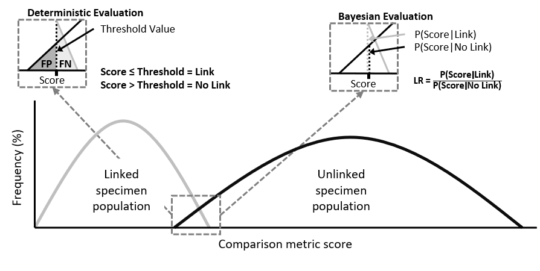
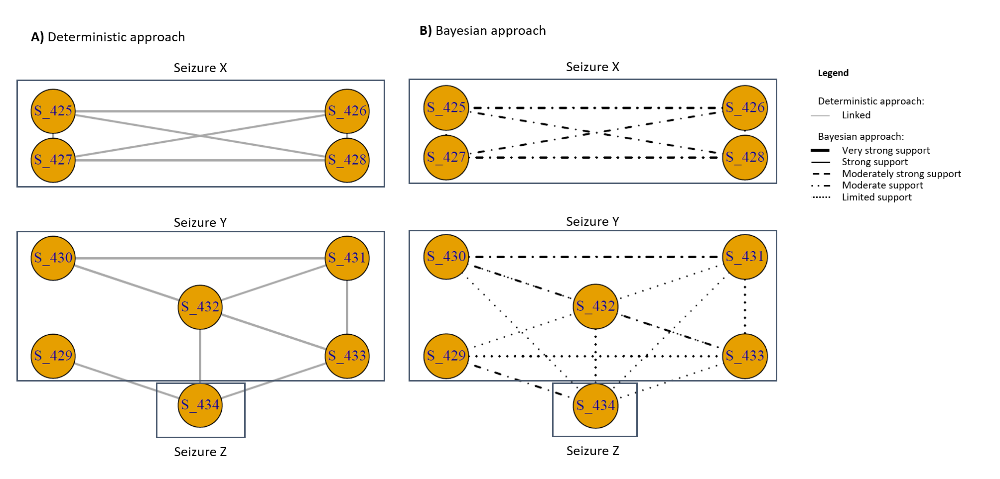

# Dual-approach-for-score-evaluation
Use of deterministic and Bayesian frameworks to interpret link values of similarity scores

## Table of contents
* [Code overview](https://github.com/PopovicAna/Dual-approach-for-score-evaluation#code-overview)
* [Introduction](https://github.com/PopovicAna/Dual-approach-for-score-evaluation#Introduction)
* [Usage](https://github.com/PopovicAna/Dual-approach-for-score-evaluation#Usage)
  * [Deep level](https://github.com/PopovicAna/Dual-approach-for-score-evaluation#Deep-level)
  * [Working level](https://github.com/PopovicAna/Dual-approach-for-score-evaluation#Working-level)
* [Author](https://github.com/PopovicAna/Dual-approach-for-score-evaluation#Author)
* [Acknowledgements](https://github.com/PopovicAna/Dual-approach-for-score-evaluation#Acknowledgements)
* [References](https://github.com/PopovicAna/Dual-approach-for-score-evaluation#References)

## Code overview
The following code reads in simulated chemical data (*original data cannot be disseminated*) for illicit drug specimens. Comparison metrics are applied to the dataset to determine the degree of similarity between specimens. This is followed by the application of deterministic and bayesian frameworks to determine link values of similarity scores. Links between a subset of specimens can also be visualised for both the deterministic and Bayesian framewok. 

## Introduction
With the constant evolution of illicit drugs markets, it is necessary to gain as much knowledge about them to disrupt or reduce their impact. Illicit drug specimens can be analysed to generate forensic intelligence and understand criminal activities. Part of this analysis involves the evaluation of similarity scores between illicit drug profiles to interpret the link value. Most studies utilise one of two prominent score evaluation approaches, i.e. deterministic or Bayesian, see Figure 1.  

The aim of this project was to assess the operational capability of a dual approach in evaluating similarity scores between illicit drug profiles. Utilising a practical example, link values were generated individually from both approaches, then compared in parallel. As a result, it was possible to generate more informed hypotheses, relating to specimen linkage, due to the greater wealth of information available from the two approaches working concurrently.



*Figure 1: Distribution of specimen scores and teh evaluation of linkage through two approaches*

Both frameworks consider two hypotheses when evaluating the link value. In the case of evaluating the score between pairs of illicit drug profiles (A and B), these can be written as:

**H1: profiles A and B are linked**

**H2: profiles A and B are not linked**

## Usage

### Deep level
In theory, the framework of the dual approach can be split into two levels, the deep and working level [1]. The deep level relates to the explicit results of each evaluation approach. 

#### Reading in the data
Before link values can be determined the dataset needs to be pre-treated; the code for this is located in the file below. For more background information about the file loaded in this section please refer to [this repository](https://github.com/PopovicAna/Prioritisation-of-analytical-techniques).

```{r, message=FALSE}
library(igraph)

source("Files/Prioritisation-of-analytical-techniques.R", local = T)
```

#### Deterministic approach
The deterministic framework is based on binary classification where a link between specimens is either present or absent, i.e. either H1 or H2 is true [1]. To determine the value of a link, the similarity score between two specimens is compared against a chosen threshold value (THV), which is related to false positive (FP) and false negative (FN) rates, see Figure 2. The setting of the THV is dependent on the decision makers’ needs and can be altered for different purposes [2]. If a law enforcement agency has certain resourcing constraints, the decision maker might choose to set the THV to minimise FP rates[2]. If the aim is to maximise the intelligence value of the data, then the value can be shifted to minimise FN rates [2]. Based on the position of the THV, links between the new specimen and the specimens in the existing database can be uncovered. The score may either fall above or below the THV indicating a link or lack of connection between the specimens.
```{r}
# Defining TP, TN, FP and FN rates at each threshold values (THV - aka CM score)
Cutoffs = data.frame(
  THV = RCM(OPT_GCMS_PT_CM_R)$thresholds,
  TPR = RCM(OPT_GCMS_PT_CM_R)$sensitivities,
  FPR = 1-RCM(OPT_GCMS_PT_CM_R)$specificities,
  FNR = 1-RCM(OPT_GCMS_PT_CM_R)$sensitivities,
  TNR = RCM(OPT_GCMS_PT_CM_R)$specificities)

Cutoffs_Sub <- Cutoffs %>% 
  select(THV,FNR,FPR) %>% 
  pivot_longer(FPR:FNR, names_to = "Rate")

# Visualising the FPR for each THV
ggplot(Cutoffs_Sub,aes(x = THV, y = value*100, group = Rate)) +
      geom_line(aes(linetype = Rate), size = 1.5) +
      scale_linetype_manual(values=c("dotted","solid")) +
      labs(title = "Use the lines to choose an appropriate Threshold Value",
           x = "Comparison Metric Score",
           y = "FP and FN rates (%)") + 
      theme_minimal()     
```

> Note: For the purpose of this research an acceptable FPR is 0.025 (i.e. 2.5%)

```{r}
# Setting an acceptable FPR to define whether specimen pairs are linked or not
LINK_THV <- as.numeric(tail(subset(Cutoffs, FPR > 0.025, select = THV), n = 1))
```

#### Bayesian approach
The second approach is based on a Bayesian framework which involves the calculation of a likelihood ratio (LR) conveying the likelihood of a link [1]. This LR is equal to the probability of a score given the two specimens are linked divided by the probability of a score given the two specimens are not linked, see Figure 2.
```{r}
# Density plot of the optimal CM and PR combination 
OPT_DENS <- ggplot(OPT_GCMS_PT_CM_R,aes(x=Freq,colour=label))+
  geom_density()+
  coord_cartesian(xlim = c(0,100))+
  labs(x="CM score",y="Frequency (%)")+
  scale_color_grey()+
  theme_light()+
  theme(plot.title=element_text(face="bold",hjust=.5),
        axis.title=element_text(face="bold"),
        legend.title=element_blank(),
        legend.position="none",
        panel.grid.major=element_blank(),
        panel.grid.minor=element_blank())

# Extracting the frequency (y-axis) of the linked and unlinked populations at each THV (x-axis)
GG_OPT_DENS = ggplot_build(OPT_DENS)

# Defining the likelihood ratio (LR) of a link at each THV
LRs = data.frame(THV=GG_OPT_DENS$data[[1]]$x[1:512], 
                 LR=((GG_OPT_DENS$data[[1]]$y[GG_OPT_DENS$data[[1]]$group==2])/
                       (GG_OPT_DENS$data[[1]]$y[GG_OPT_DENS$data[[1]]$group==1])))

# Visualising the LR for each THV
ggplot(LRs, aes(x=THV,y=LR))+
  geom_line(size=1)+
  scale_fill_grey()+
  theme_light()+
  labs(x="CM score",y="LR")+
  theme(axis.title=element_text(face="bold"),
        panel.grid.major=element_blank(),
        panel.grid.minor=element_blank())
```

*Figure 2: Distribution of LRs for each comparison metric score (i.e. THV)*

As well as stating a quantitative value for the LR, it is commonly accompanied by a verbal equivalent, supporting the interpretation of the LR value [3].

Likelihood ratio|	Verbal scale 
- | -
LR < 0.0001	| Very strong support for H2 rather than H1
0.0001 ≤ LR < 0.001	| Strong support for H2 rather than H1
0.001 ≤ LR < 0.01	| Moderately strong support for H2 rather than H1
0.01 ≤ LR < 0.1	| Moderate support for H2 rather than H1
0.1 ≤ LR < 1	| Limited support for H2 rather than H1
1	| No support for either hypothesis
1 < LR ≤ 10	| Limited support for H1 rather than H2
10 < LR ≤ 100	| Moderate support for H1 rather than H2
100 < LR ≤ 1000	| Moderately strong support for H1 rather than H2
1000 < LR ≤ 10000	| Strong support for H1 rather than H2
10000 < LR	Very | strong support for H1 rather than H2

```{r}
# Function for the verbal equivalent of the LR
LR_Verbal <- function(LR){
  ifelse(LR>10000,"VSS_H1",
         ifelse(LR<=10000&LR>1000,"SS_H1",
                ifelse(LR<=1000&LR>100,"MSS_H1",
                       ifelse(LR<=100&LR>10,"MS_H1",
                              ifelse(LR<=10&LR>1,"LS_H1",
                                     ifelse(LR<=1&LR>0.1,"LS_H2",
                                            ifelse(LR<=0.1&LR>0.01,"MS_H2",
                                                   ifelse(LR<=0.01&LR>0.001,"MSS_H2",
                                                          ifelse(LR<=0.001&LR>0.0001,"SS_H2",
                                                                 ifelse(LR<=0.0001,"VSS_H2","")
                                                          )))))))))
}
```


### Working level
The working level relates to the hypotheses formulated based on the analysis of results in the deep level, see Figure 3. Postulated links in either approach (deep level) may exist or not depending on the suggested WH. WHs can initiate necessary analysis which can guide decisions and operations. To illustrate the viability of the two approaches working in combination, a practical example is given using a subset of specimens.
```{r, fig.dim=c(10,10)}
# Extracting a subset of values
Sub_GCMS <- GCMS %>%  filter(rownames(GCMS) %in% Lookup$Specimen[Lookup$Date=="2017-09-01"]) %>% as.matrix()
rownames(Sub_GCMS) <- Lookup$Specimen[Lookup$Date=="2017-09-01"]

# Calculating similarity between specimens based on the optimal comparison metric
Scores_Sub_GCMS <- get(OPT_GCMS_CM)(Sub_GCMS)
Scores_Sub_GCMS[upper.tri(Scores_Sub_GCMS)] = NA
diag(Scores_Sub_GCMS) = NA
Scores_Sub_GCMS = as.data.frame.table(Scores_Sub_GCMS)
Scores_Sub_GCMS = na.omit(Scores_Sub_GCMS)
colnames(Scores_Sub_GCMS) <- c("From","To","Score")

#Defining the LR and verbal equivalent based on the deep level results
Scores_Sub_GCMS$LR <-  unlist(lapply(Scores_Sub_GCMS$Score,function(W) head(subset(LRs, THV>= W, select = LR),n=1)))
Scores_Sub_GCMS$LR_V <- unlist(LR_Verbal(Scores_Sub_GCMS$LR))

# Plot of links based on the Deterministic approach
netTHV = graph_from_data_frame(d=Scores_Sub_GCMS, directed = F)
E(netTHV)$lty="solid"
E(netTHV)$width="2"
E(netTHV)$color="darkgrey"

LayOut <- matrix(c(2,0,2,0,0,2,1,2,1,0,
                   3,2.5,2.5,0.5,1.5,1.5,1,0.5,0,3),
                 nrow = 10,
                 ncol = 2)

# plot(delete_edges(netTHV, which(E(netTHV)$Score>=LINK_THV)),layout = LayOut)

# Plot of the likelihood of a link based on the Bayesian approach
set.seed(1272)
netLR = graph_from_data_frame(d=Scores_Sub_GCMS, directed = F)
E(netLR)$lty=
  ifelse(Scores_Sub_GCMS$LR>1000,"solid",
         ifelse(Scores_Sub_GCMS$LR<=1000&Scores_Sub_GCMS$LR>100,"dashed",
                ifelse(Scores_Sub_GCMS$LR<=100&Scores_Sub_GCMS$LR>10,"dotdash",
                       ifelse(Scores_Sub_GCMS$LR<=10&Scores_Sub_GCMS$LR>1,"dotted",
                              ifelse(Scores_Sub_GCMS$LR<=1&Scores_Sub_GCMS$LR>0.1,"dotted",
                                     ifelse(Scores_Sub_GCMS$LR<=0.1&Scores_Sub_GCMS$LR>0.01,"dotdash",
                                            ifelse(Scores_Sub_GCMS$LR<=0.01&Scores_Sub_GCMS$LR>0.001,"dashed",
                                                   ifelse(Scores_Sub_GCMS$LR<=0.001&Scores_Sub_GCMS$LR>0.0001,"solid",
                                                          ifelse(Scores_Sub_GCMS$LR<=0.0001,"solid","")
                                                   ))))))))
E(netLR)$width=ifelse(Scores_Sub_GCMS$LR<0.0001,"4","2")
E(netLR)$color=ifelse(Scores_Sub_GCMS$LR>1,"Black",ifelse(Scores_Sub_GCMS$LR<1,"Red",""))
# plot(netLR,layout = LayOut)

# Remove any edges with no support for linkage between specimens
#plot(delete_edges(netLR, which(E(netLR)$LR<=1)),layout = LayOut))

# Visualising the Det and Bayes results for the subset of specimens -------
# par(mfrow=c(1,2))
# plot(delete_edges(netTHV, which(E(netTHV)$Score>=LINK_THV)), layout = LayOut)
# plot(delete_edges(netLR, which(E(netLR)$LR<=1)), layout = LayOut)
```



*Figure 3: Deep level of the dual approach for the ENIPID subset; A) is the deterministic approach, where solid grey line represents a link; B) is the Bayesian approach, with different lines representing different strengths of LRs for the H1 only*

Although each approach has its advantages and neither of these approaches can systematically be considered superior, the deterministic approach is easier to interpret as it delivers a binary result associated with FP and FN values. This approach is appreciated when timely decisions need to be made. However, potentially important links just below the THV may be missed if the deterministic approach is used in isolation. In this instance the Bayesian approach would provide the added value to the analysis. Evaluating scores using a LR would allow for all postulated links to be explored. The drawback of this approach is that there is no clear result regarding linkage. Although the LR can be used to guide experts in making informed decisions, the lack of a concrete result regarding linkage (e.g. a binary yes/no result) limits the capacity of the approach to further evaluate specimens, such as through trend analysis.

## Author 
Ana Popovic - [popovicana](https://github.com/PopovicAna)


## Acknowledgements
This work is supported by an Australian Research Council grant (LP160100352).

## References
1. Baechler, S., et al., Forensic intelligence framework. Part II: Study of the main generic building blocks and challenges through the examples of illicit drugs and false identity documents monitoring. Forensic Science International, 2015. 250: p. 44-52.
2. Morelato, M., et al., The use of organic and inorganic impurities found in MDMA police seizures in a drug intelligence perspective. Sci Justice, 2014. 54(1): p. 32-41.
3. Lucy, D., Introduction to statistics for forensic scientists. 2013: John Wiley & Sons.